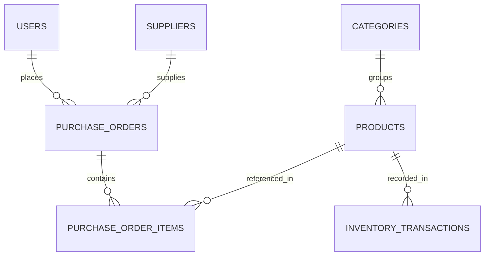

# MCS-Procurement-Inventory-System

[Optional badges: build / license / latest release]

A Laravel-based Procurement and Inventory Management System for MCS. The app helps manage suppliers, products, purchase orders, stock levels, approvals, and basic reporting — suitable for small-to-medium organizations.

Table of contents
- About
- Key features
- Tech stack
- Architecture & ER diagram
- API (example endpoints)
- Installation & local dev (quickstart)
- Environment variables
- Database, migrations & seeding
- Running & building assets
- Testing
- CI (GitHub Actions) example
- Deployment checklist
- Troubleshooting
- Contributing
- Security
- License
- Contact

## About
This repo contains the source code for MCS Procurement & Inventory System built with Laravel. It implements roles (admin, procurement_officer, inventory_clerk), purchase order workflows, inventory tracking, and basic reporting.

## Key features
- Supplier, product, and category management
- Purchase order creation, approval, rejection
- Inventory adjustments, stock movement & stock takes
- Purchase history and stock-level reporting
- User roles & permissions
- CSV import/export (products, suppliers)
- Email notifications for approvals (optional)

## Tech stack
- PHP 8.x, Laravel 9/10 (confirm version in composer.json)
- MySQL / MariaDB (or PostgreSQL)
- Redis (optional, for cache & queues)
- NPM + Vite + TailwindCSS or Bootstrap
- GitHub Actions for CI (example included)

## Architecture & ER diagram
Primary models:
- User (roles)
- Supplier
- Category
- Product (belongsTo Category)
- PurchaseOrder (belongsTo Supplier, hasMany PurchaseOrderItem)
- PurchaseOrderItem (belongsTo Product)
- InventoryTransaction (product, qty, type, reference_id)
- Role / Permission (optional: spatie/laravel-permission)

Mermaid ER diagram (GitHub supports mermaid in some renderers — view in a capable viewer or use the ASCII diagram below):



ASCII overview:
- users (id, name, email, role_id, ...)
- suppliers (id, name, contact, email, address, ...)
- categories (id, name, description)
- products (id, sku, name, category_id, unit_price, stock_qty, reorder_point)
- purchase_orders (id, supplier_id, created_by, status, total, approved_at)
- purchase_order_items (id, purchase_order_id, product_id, qty, unit_price)
- inventory_transactions (id, product_id, qty, type, reference_type, reference_id, note, created_by)

## API (example endpoints)
This section lists representative HTTP API endpoints and example requests/responses. Adjust to match your route definitions.

Authentication (using sanctum / passport / JWT — update accordingly)
- POST /api/auth/login
  - Body: { "email": "user@example.com", "password": "secret" }
  - Response: { "token": "..." }

Suppliers
- GET /api/suppliers
- POST /api/suppliers
  - Body: { "name": "...", "email": "...", "phone": "...", "address": "..." }

Products
- GET /api/products
- POST /api/products
  - Body: { "sku": "P-001", "name": "Widget", "category_id": 1, "unit_price": 9.99, "stock_qty": 100 }

Purchase Orders
- GET /api/purchase-orders
- POST /api/purchase-orders
  - Body: { "supplier_id": 1, "items": [{ "product_id": 1, "qty": 10, "unit_price": 9.5 }], "notes": "Urgent" }
- POST /api/purchase-orders/{id}/approve
  - Body: { "approved_by": 2, "comment": "Ok" }

Inventory adjustments
- POST /api/inventory/adjustments
  - Body: { "product_id": 1, "qty": -5, "type": "adjust", "note": "damage" }

Example cURL (create a PO):
```bash
curl -X POST https://your-host/api/purchase-orders \
  -H "Authorization: Bearer $TOKEN" \
  -H "Content-Type: application/json" \
  -d '{
    "supplier_id": 1,
    "items": [{"product_id": 1, "qty": 10, "unit_price": 9.5}],
    "notes": "Urgent"
  }'
```

Responses should follow consistent structure — e.g., { "success": true, "data": {...}, "errors": null }

Authentication & authorization
- Protect API routes via middleware (auth:sanctum or auth:api).
- Apply role checks for sensitive actions (approve PO, inventory adjustments).

## Installation & local dev (quickstart)
1. Clone
   git clone https://github.com/LouisaSianot/MCS-Procurement-Inventory-System.git
   cd MCS-Procurement-Inventory-System

2. Install PHP dependencies
   composer install

3. Install JS dependencies
   npm install

4. Copy env and generate key
   cp .env.example .env
   php artisan key:generate

5. Configure .env (DB settings, MAIL, etc.) — see next section

6. Run migrations & seeders
   php artisan migrate --seed

7. Build frontend assets (development)
   npm run dev

8. Serve app
   php artisan serve

## Environment variables (important)
- APP_NAME, APP_ENV, APP_KEY, APP_URL
- DB_CONNECTION, DB_HOST, DB_PORT, DB_DATABASE, DB_USERNAME, DB_PASSWORD
- MAIL_MAILER, MAIL_HOST, MAIL_PORT, MAIL_USERNAME, MAIL_PASSWORD, MAIL_FROM_ADDRESS
- QUEUE_CONNECTION (database/redis)
- CACHE_DRIVER (redis/file)
- BROADCAST_DRIVER (pusher/log)
- SANCTUM_STATEFUL_DOMAINS / SESSION_DOMAIN (if using sanctum)

Document any additional custom env keys in config/*.php and .env.example.

## Database, migrations & seeders
- Migrations live in database/migrations.
- Seeders live in database/seeders. Recommended seeders:
  - RolesAndPermissionsSeeder
  - UsersTableSeeder (admin user)
  - SuppliersSeeder
  - CategoriesSeeder
  - ProductsSeeder

Run:
php artisan migrate --seed

If you change migrations on a shared environment, use:
php artisan migrate --force

## Running & building assets
- Dev build: npm run dev
- Production build: npm run build
- Hot reload: npm run hot (Vite)

Ensure public/storage is linked:
php artisan storage:link

## Testing
Run the test suite:
php artisan test

Tips:
- Use an in-memory or dedicated test database.
- Configure parallel testing (pest or phpunit) if supported.
- Include DB transactions in tests where needed.

## CI (GitHub Actions) example
Add `.github/workflows/ci.yml`:

```yaml
name: CI

on: [push, pull_request]

jobs:
  tests:
    runs-on: ubuntu-latest
    services:
      mysql:
        image: mysql:8
        env:
          MYSQL_ROOT_PASSWORD: password
          MYSQL_DATABASE: test_db
        ports:
          - 3306:3306
        options: >-
          --health-cmd "mysqladmin ping --silent"
          --health-interval 10s
          --health-timeout 5s
          --health-retries 3

    steps:
      - uses: actions/checkout@v4
      - name: Setup PHP
        uses: shivammathur/setup-php@v2
        with:
          php-version: 8.1
          extensions: mbstring, bcmath, intl, pdo_mysql
      - name: Setup Node
        uses: actions/setup-node@v4
        with:
          node-version: 18
      - name: Install composer dependencies
        run: composer install --no-progress --no-suggest --prefer-dist
      - name: Install npm dependencies
        run: npm ci
      - name: Copy env
        run: cp .env.example .env
      - name: Generate app key
        run: php artisan key:generate
      - name: Configure DB
        run: |
          php artisan migrate --env=testing --no-interaction
      - name: Run tests
        run: php artisan test --verbose
```

## Deployment checklist
- Use supported PHP version and matching extensions.
- Set APP_ENV=production and APP_DEBUG=false.
- Ensure storage and bootstrap/cache are writable.
- Configure queue workers (Supervisor) if QUEUE_CONNECTION != sync.
- Run composer install --no-dev --optimize-autoloader.
- Run php artisan config:cache, route:cache, view:cache.
- Run php artisan migrate --force.
- Ensure backups (DB dump) and monitoring are in place.
- Configure SSL, domain, and email provider.

## Troubleshooting
- 500 error: check storage/logs/laravel.log and webserver logs.
- Mail not sending: verify MAIL_* env values and queue processing.
- Permission issues: ensure web user can write to storage/ and bootstrap/cache.

## Contributing
- Fork the repo and open PRs against main.
- Follow PSR-12 coding standards.
- Add tests for new features or bug fixes.
- Document new env variables and migrations in the PR description.
- If opening a large or breaking change, open an issue first to discuss.

## Security
If you discover a security vulnerability, please contact the maintainer privately (email) before opening a public issue.

## License
MIT — see the LICENSE file.

## Contact
Maintainer: Louisa Sianot — https://github.com/LouisaSianot
